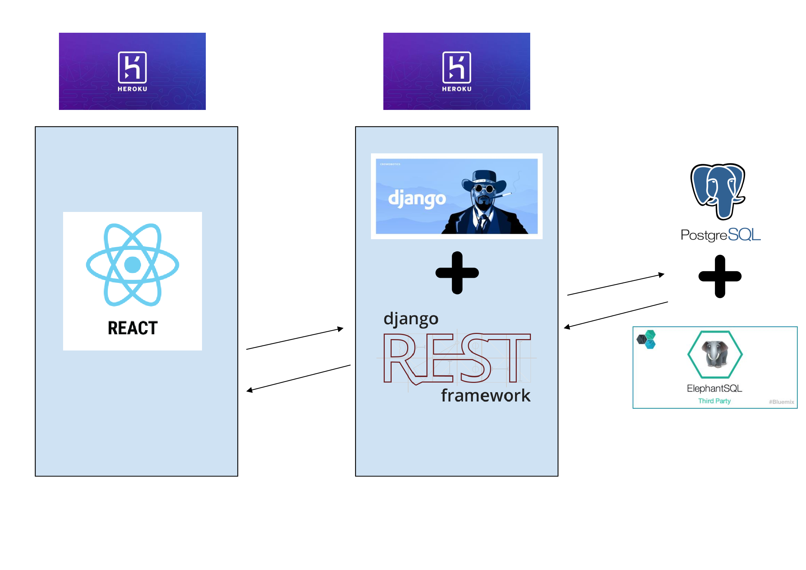

# WisHub

# Disclaimer
WisHub project started in January 2021, when a group of 4 developers and students of AGH university - Tymoteusz Ciesielski, Aleksander Morgała, Mateusz Górczany
and Maciej Podbioł - known as **Waleczne Kaszkiety** decided to participate in the BITEhack Hackathon.
Effects of their 24h work can be found in the following repository:
https://github.com/wujekstaszek/BITEHack2021WaleczneKaszkiety

Later on, the project was developed, and presented for a university course
featuring Software Engineering Methodologies.
Tymoteusz Ciesielski and Mateusz Górczany from the previous team, created a new team
together with Olga Kubiszyn, Marta Grzesiak, Michał Kacprzak and Jakub Perlak.
This repository is the fruit of their joint labour.

# Team members
**Frontend team**
- Michał Kacprzak - project team leader
- Olga Kubiszyn
- Marta Grzesiak

**Backend team**
- Tymoteusz Ciesielski - backend team leader
- Mateusz Górczany
- Jakub Perlak

# Project description
On the Internet, there are tons of different learning materials. It is possible to instantly start learning anything. However the problem is the varying quality of the materials.

We have decided to develop a platform which groups learning materials (tutorials, videos, mini-projects), sorts them basing on their subject, and later allows the portal users to upvote/downvote them and comment. The mechanism is quite similar to reddit or Stack Overflow portals.
Basing on users' votes, ranked list of materials is created, allowing to quickly find the best materials
to learn some new technology - for example Django.

There is also the whole user platform and functionalities of adding new posts, commenting, voting, sending messages and more.
At the moment, the project is deployed and may be accessed here (It might be necessary to wait some time for the Heroku containers to warm up):
https://wishub.herokuapp.com/

# Tech stack
- Backend: Django with Django REST framework, PostgreSQL database
- Frontend: React

Update 8.11.2022
Starting from November 28, 2022 free plans on Heroku, including the free dynos on which WisHub runs are no longer available. New method of deployment is needed for the app to keep running.

*Readme written by Tymoteusz Ciesielski* \
04-09-2021
